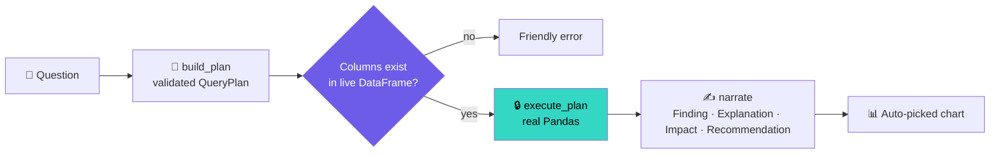

<div align="center">


### 🧠 Intelligent Data Analyst Suite — now with live 3D


**[✨ Features](#-features) · [🏗 Architecture](#-architecture) · [🚀 Quick start](#-quick-start) · [💬 Try these questions](#-try-these-questions) · [🗂 Structure](#-project-structure) · [🛣 Roadmap](#-roadmap)**

</div>

---

Sign up, upload a CSV/Excel file, and get automatic profiling, natural-language querying, forecasting, anomaly detection, customer segmentation, **interactive 3D exploration**, and one-click reports — all backed by real Pandas computation, **never LLM-hallucinated numbers.**

> 💡 **Click any ▶ section below to expand it.**

## 🎯 Why VERIDEXA is different

Most "chat with your data" tools let an LLM guess at numbers. VERIDEXA keeps a hard separation: **only `modules/query_engine.py` may produce a number.** The AI Analyst only *phrases* numbers that were already computed. No API key needed.

## 🏗 Architecture

<div align="center">

</div>

<details>
<summary><b>▶ Same flow as a diagram (click to expand)</b></summary>



</details>

## ✨ Features

### 🧊 3D & animated experience

| | Feature | What you get |
|---|---|---|
| 🌐 | **WebGL landing hero** | Three.js icosahedron + particle swarm — auto-rotates, drag to orbit |
| 🃏 | **Mouse-tilt feature cards** | True 3D perspective that follows your cursor |
| 🧊 | **3D Explorer page** | Draggable 3D scatter, correlation surface, density landscape |
| 🔢 | **Count-up KPI cards** | Numbers animate from 0, with inline sparklines |
| 🎬 | **Animated charts** | Draw-in trend lines and a play-button bar race |
| 👥 | **3D cluster view** | K-Means results rotate in 3D when you pick 3+ features |

### 🧰 Core analytics

<details>
<summary><b>▶ 🔐 Auth, upload &amp; data prep</b></summary>

- **Full auth flow** — PBKDF2-HMAC-SHA256 hashing, lockout after repeated failures, enforced session timeout, WAL-mode SQLite
- **Upload & Clean** — CSV / Excel / JSON / Parquet, encoding sniffing, dtype inference, dupes / missing / outlier cleaning
- **Combine / Join** — inner / left / right / outer joins across loaded files
- **Persistent storage** — save datasets to your account as Parquet-in-SQLite

</details>

<details>
<summary><b>▶ 📊 Exploration &amp; dashboards</b></summary>

- **Data Explorer** — overview, quality, numeric stats, categorical breakdowns, interactive filters
- **Analytics Dashboard** — auto-adapting KPIs, trends, breakdowns, correlation (2D heatmap ⇄ 3D surface)
- **Automated EDA** — correlations, outliers, findings, recommendations

</details>

<details>
<summary><b>▶ 🤖 AI Analyst, forecasting &amp; segmentation</b></summary>

- **AI Analyst** — chat with a Finding / Explanation / Business Impact / Recommendation answer; resolves "it" / "that"; optional Groq / OpenAI / Anthropic / Ollama rephrasing
- **Forecasting** — OLS linear trend or Holt-Winters seasonal, with confidence bands and decomposition
- **Anomaly Detection** — IQR flags with risk level and plain-language reason
- **Segmentation** — RFM rules or K-Means (2D or 3D)
- **AI Recommendations** — prioritized actions from whatever you've run
- **Reports** — CSV / Excel / HTML / native PDF

</details>

### 🚀 Power-ups (20 extras)

<details>
<summary><b>▶ See all 20</b></summary>

| # | Feature | # | Feature |
|---|---|---|---|
| 1 | 🌓 Light / Dark theme toggle | 11 | ⭐ Pin favorite datasets |
| 2 | 🔎 Command-palette page jump | 12 | 📝 Blank CSV template download |
| 3 | 🩺 Data Health Score (0–100) | 13 | 🕒 Activity Log page |
| 4 | 🚦 Per-column quality traffic lights | 14 | 🔔 Toast notifications |
| 5 | ✨ KPI sparklines | 15 | 🔢 Compact ⇄ full number format |
| 6 | ☁️ Word cloud | 16 | 💾 Chart → standalone HTML |
| 7 | 📐 Period-over-period card | 17 | 📤 Chart data → CSV |
| 8 | 🆚 Dataset diff / compare | 18 | 🔍 Global full-text row search |
| 9 | ⧉ One-click dataset clone | 19 | 🧭 Session summary widget |
| 10 | ↩️ Undo last cleaning action | 20 | 🎯 "Suggest best chart" recommender |

</details>

## 🚀 Quick start

```bash
python -m venv venv
source venv/bin/activate        # Windows: venv\Scripts\activate
pip install -r requirements.txt
streamlit run app.py
```

Open the URL Streamlit prints (usually `http://localhost:8501`) and create an account.

<details>
<summary><b>▶ Optional: enable LLM rephrasing</b></summary>

```bash
cp .env.example .env   # then add a Groq / OpenAI / Anthropic key, or point at local Ollama
```

Fully optional — the app works without it.

</details>

<details>
<summary><b>▶ Run the tests</b></summary>

```bash
pytest
```

Covers the loader, profiler, query engine, forecasting, anomaly detection, segmentation, and auth. CI runs on Python 3.10–3.12.

</details>

## 💬 Try these questions

<details open>
<summary><b>▶ Click to copy ideas into the AI Analyst</b></summary>

```text
What is the total revenue?
Which region generated the highest revenue?
What is the monthly revenue trend?
Is there a correlation between quantity and profit?
Average profit
Top 5 category by revenue
what about its monthly trend?        ← follow-up, resolves "its"
```

</details>

## 🧱 Tech stack

| Layer | Technology |
|---|---|
| Frontend | Streamlit + Three.js (landing hero) |
| Data | Pandas, NumPy, PyArrow |
| Visualization | Plotly (2D, 3D, animated frames) |
| ML / Forecasting | scikit-learn, NumPy OLS, statsmodels Holt-Winters |
| Auth + storage | SQLite (WAL), stdlib `hashlib` PBKDF2 |
| Export | HTML, Excel (openpyxl), PDF (xhtml2pdf) |
| Testing / CI | pytest, GitHub Actions |

## 🗂 Project structure

<details>
<summary><b>▶ Expand the tree</b></summary>

```text
VERIDEXA/
├── app.py                     # Entry point — auth gate, sidebar, page routing
├── assets/                    # Animated README SVGs
├── config/settings.py
├── modules/
│   ├── auth.py / db.py        # Accounts, audit log, saved datasets
│   ├── ui_auth.py             # 3D landing page + login / signup
│   ├── data_loader.py / data_cleaner.py / data_profiler.py
│   ├── dashboard.py           # Animated KPIs, 3D toggles, period-over-period
│   ├── query_engine.py        # ⭐ The only place a number is computed
│   ├── insight_generator.py / ai_analyzer.py
│   ├── eda_generator.py / forecasting.py / anomaly_detection.py
│   ├── segmentation.py / recommendation_engine.py
│   ├── report_generator.py
│   ├── visualization.py       # 2D, 3D and animated Plotly builders
│   └── extra_features.py      # Health score, word cloud, diff, sparklines…
├── utils/                     # logger, validators, helpers
├── tests/
└── logs/
```

</details>

## 🛣 Roadmap

- [x] Auth, upload, join, persistent storage
- [x] AI Analyst, forecasting, anomalies, segmentation, reports (CSV / Excel / HTML / PDF)
- [x] CI with pytest
- [x] 3D explorer, animated charts, activity log viewer
- [ ] External connectors (Google Sheets / Postgres / MySQL)
- [ ] Real LLM phrasing in `ai_analyzer.py`
- [ ] Role-based access control
- [ ] PowerPoint export
- [ ] Scheduled email / Slack reports

## 🔒 Security notes

<details>
<summary><b>▶ Read before deploying</b></summary>

- Passwords: PBKDF2-HMAC-SHA256, unique salt per user, 260,000 iterations.
- Every AI Analyst query re-validates each column name against the live DataFrame immediately before execution; no `eval`.
- This is a portfolio/demo app: the SQLite auth DB is local and unencrypted at rest, with no HTTPS or cookie hardening. Add those before storing real user data.

</details>

<div align="center">

<sub>Built with Pandas, Plotly &amp; Three.js · Every number is computed, never guessed.</sub>

</div>
