<div align="center">

# VERIDEXA

### 🧠 Intelligent Data Analyst Suite, now with live 3D


**[✨ Features](#-features) · [🏗 Architecture](#-architecture) · [🔄 Flowcharts](#-deep-dive-flowcharts) · [🚀 Quick start](#-quick-start) · [💬 Try these questions](#-try-these-questions) · [🗂 Structure](#-project-structure) · [🛣 Roadmap](#-roadmap)**

</div>

---

Sign up, upload a CSV/Excel file, and get automatic profiling, natural-language querying, forecasting, anomaly detection, customer segmentation, **interactive 3D exploration**, and one-click reports, all backed by real Pandas computation, **never LLM-hallucinated numbers.**

> 💡 **Click any ▶ section below to expand it.** Every major feature has its own flowchart so you can see exactly *how* it works, not just *what* it does.

---

## 📑 Table of contents

1. [Why VERIDEXA is different](#-why-veridexa-is-different)
2. [The big picture](#-the-big-picture)
3. [Architecture](#-architecture)
4. [Features](#-features)
5. [Deep-dive flowcharts](#-deep-dive-flowcharts)
6. [Data model](#-data-model)
7. [Quick start](#-quick-start)
8. [Configuration](#-configuration)
9. [Try these questions](#-try-these-questions)
10. [Tech stack](#-tech-stack)
11. [Project structure](#-project-structure)
12. [Testing & CI](#-testing--ci)
13. [Security notes](#-security-notes)
14. [Troubleshooting](#-troubleshooting)
15. [FAQ](#-faq)
16. [Roadmap](#-roadmap)
17. [Contributing](#-contributing)

---

## 🎯 Why VERIDEXA is different

Most "chat with your data" tools hand your table (or a summary of it) to an LLM and let it *guess* the answer. That works until the model quietly invents a total, rounds a percentage the wrong way, or confidently answers about a column that does not exist.

VERIDEXA keeps a **hard separation of responsibilities**:

| Responsibility | Who does it | Can it produce a number? |
|---|---|---|
| Understand the question | `build_plan` (rule-based planner) | ❌ No |
| Check the plan is legal | Column validator against the live DataFrame | ❌ No |
| **Compute the answer** | **`modules/query_engine.py` (real Pandas)** | ✅ **Only this module** |
| Phrase the answer in words | `narrate` / optional LLM rephrase | ❌ No, it only receives numbers that were already computed |
| Draw the chart | Auto chart picker + Plotly | ❌ No, it plots computed results |

**Only `modules/query_engine.py` may produce a number.** The AI Analyst only *phrases* numbers that were already computed. No API key needed.

### Typical "chat with data" vs VERIDEXA

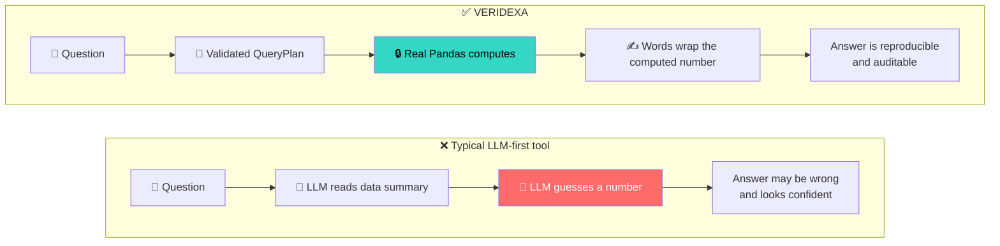
```mermaid
flowchart LR
    subgraph TYPICAL["❌ Typical LLM-first tool"]
        direction LR
        A1["💬 Question"] --> A2["🤖 LLM reads data summary"]
        A2 --> A3["🎲 LLM guesses a number"]
        A3 --> A4["Answer may be wrong<br/>and looks confident"]
    end

    subgraph VERI["✅ VERIDEXA"]
        direction LR
        B1["💬 Question"] --> B2["🧩 Validated QueryPlan"]
        B2 --> B3["🔒 Real Pandas computes"]
        B3 --> B4["✍️ Words wrap the computed number"]
        B4 --> B5["Answer is reproducible<br/>and auditable"]
    end

    style A3 fill:#ff6b6b,color:#fff
    style B3 fill:#34D6C4,color:#000
```

---

## 🌍 The big picture

From a user's point of view, VERIDEXA is a guided journey: **get in → get data in → understand it → ask it questions → act on it → export it.**

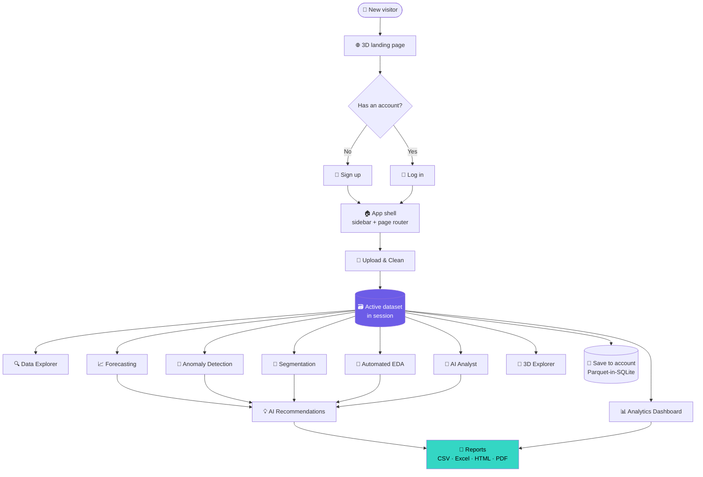
```mermaid
flowchart TD
    S(["🧑 New visitor"]) --> L["🌐 3D landing page"]
    L --> AUTH{"Has an account?"}
    AUTH -- No --> SU["📝 Sign up"]
    AUTH -- Yes --> LI["🔑 Log in"]
    SU --> APP
    LI --> APP["🏠 App shell<br/>sidebar + page router"]

    APP --> UP["📂 Upload & Clean"]
    UP --> DS[("🗃 Active dataset<br/>in session")]

    DS --> EXP["🔍 Data Explorer"]
    DS --> DASH["📊 Analytics Dashboard"]
    DS --> EDA["🧪 Automated EDA"]
    DS --> AI["🤖 AI Analyst"]
    DS --> FC["📈 Forecasting"]
    DS --> AN["🚨 Anomaly Detection"]
    DS --> SEG["👥 Segmentation"]
    DS --> X3D["🧊 3D Explorer"]

    FC --> REC["💡 AI Recommendations"]
    AN --> REC
    SEG --> REC
    EDA --> REC
    AI --> REC

    REC --> REP["📄 Reports<br/>CSV · Excel · HTML · PDF"]
    DASH --> REP
    DS --> SAVE[("💾 Save to account<br/>Parquet-in-SQLite")]

    style DS fill:#6C5CE7,color:#fff
    style REP fill:#34D6C4,color:#000
```

---

## 🏗 Architecture

The query pipeline at a glance:

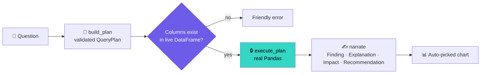
```mermaid
flowchart LR
    Q[💬 Question] --> P[🧩 build_plan<br/>validated QueryPlan]
    P --> V{Columns exist<br/>in live DataFrame?}
    V -- no --> E[Friendly error]
    V -- yes --> X[🔒 execute_plan<br/>real Pandas]
    X --> N[✍️ narrate<br/>Finding · Explanation · Impact · Recommendation]
    N --> C[📊 Auto-picked chart]
    style X fill:#34D6C4,color:#000
    style V fill:#6C5CE7,color:#fff
```

### Layered view

VERIDEXA is organised in clear layers. A layer may only call the layer(s) beneath it, which keeps the "numbers only come from the query engine" rule enforceable.

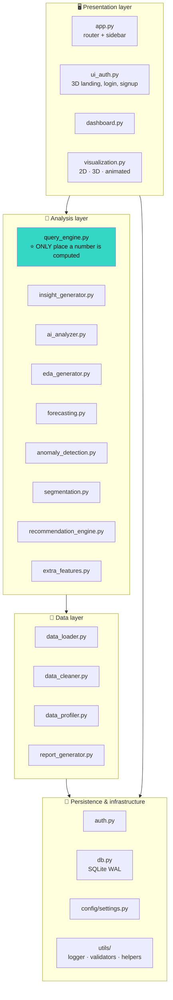
```mermaid
flowchart TB
    subgraph L1["🖥 Presentation layer"]
        direction LR
        APP["app.py<br/>router + sidebar"]
        UIA["ui_auth.py<br/>3D landing, login, signup"]
        DSH["dashboard.py"]
        VIZ["visualization.py<br/>2D · 3D · animated"]
    end

    subgraph L2["🧠 Analysis layer"]
        direction LR
        QE["query_engine.py<br/>⭐ ONLY place a number is computed"]
        INS["insight_generator.py"]
        AIA["ai_analyzer.py"]
        EDA["eda_generator.py"]
        FOR["forecasting.py"]
        ANO["anomaly_detection.py"]
        SEG["segmentation.py"]
        REC["recommendation_engine.py"]
        EXT["extra_features.py"]
    end

    subgraph L3["🧹 Data layer"]
        direction LR
        LOAD["data_loader.py"]
        CLEAN["data_cleaner.py"]
        PROF["data_profiler.py"]
        REPG["report_generator.py"]
    end

    subgraph L4["💾 Persistence & infrastructure"]
        direction LR
        AUTH["auth.py"]
        DB["db.py<br/>SQLite WAL"]
        CFG["config/settings.py"]
        UTL["utils/<br/>logger · validators · helpers"]
    end

    L1 --> L2
    L2 --> L3
    L3 --> L4
    L1 --> L4

    style QE fill:#34D6C4,color:#000
```

### Module dependency map

Which module talks to which. Notice that `ai_analyzer` and `insight_generator` depend on `query_engine`, never the other way around.

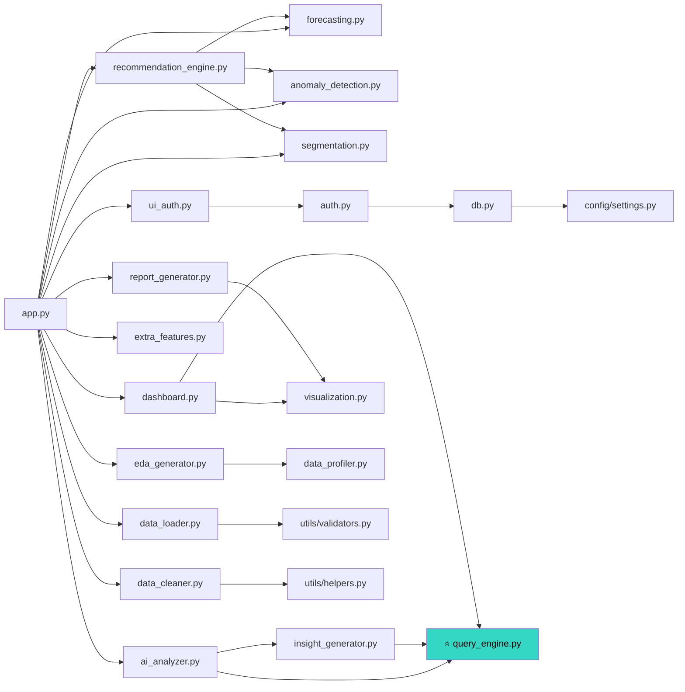
```mermaid
flowchart LR
    app["app.py"] --> ui_auth["ui_auth.py"]
    app --> dashboard["dashboard.py"]
    app --> ai_analyzer["ai_analyzer.py"]
    app --> eda_generator["eda_generator.py"]
    app --> forecasting["forecasting.py"]
    app --> anomaly["anomaly_detection.py"]
    app --> segmentation["segmentation.py"]
    app --> reco["recommendation_engine.py"]
    app --> report["report_generator.py"]
    app --> extra["extra_features.py"]

    ui_auth --> auth["auth.py"]
    auth --> db["db.py"]

    ai_analyzer --> query_engine["⭐ query_engine.py"]
    ai_analyzer --> insight["insight_generator.py"]
    insight --> query_engine
    dashboard --> query_engine
    dashboard --> viz["visualization.py"]
    eda_generator --> profiler["data_profiler.py"]
    reco --> forecasting
    reco --> anomaly
    reco --> segmentation
    report --> viz

    app --> loader["data_loader.py"]
    app --> cleaner["data_cleaner.py"]
    loader --> validators["utils/validators.py"]
    cleaner --> helpers["utils/helpers.py"]
    db --> settings["config/settings.py"]

    style query_engine fill:#34D6C4,color:#000
```

### Life of a single question (sequence)

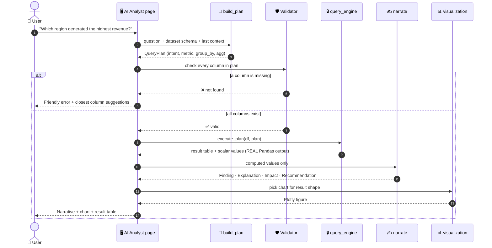
```mermaid
sequenceDiagram
    autonumber
    actor U as 🧑 User
    participant UI as 🖥 AI Analyst page
    participant PL as 🧩 build_plan
    participant VA as 🛡 Validator
    participant QE as 🔒 query_engine
    participant NA as ✍️ narrate
    participant VZ as 📊 visualization

    U->>UI: "Which region generated the highest revenue?"
    UI->>PL: question + dataset schema + last context
    PL-->>UI: QueryPlan (intent, metric, group_by, agg)
    UI->>VA: check every column in plan
    alt a column is missing
        VA-->>UI: ❌ not found
        UI-->>U: Friendly error + closest column suggestions
    else all columns exist
        VA-->>UI: ✅ valid
        UI->>QE: execute_plan(df, plan)
        QE-->>UI: result table + scalar values (REAL Pandas output)
        UI->>NA: computed values only
        NA-->>UI: Finding · Explanation · Impact · Recommendation
        UI->>VZ: pick chart for result shape
        VZ-->>UI: Plotly figure
        UI-->>U: Narrative + chart + result table
    end
```

---

## ✨ Features

### 🧊 3D & animated experience

| | Feature | What you get |
|---|---|---|
| 🌐 | **WebGL landing hero** | Three.js icosahedron + particle swarm, auto-rotates, drag to orbit |
| 🃏 | **Mouse-tilt feature cards** | True 3D perspective that follows your cursor |
| 🧊 | **3D Explorer page** | Draggable 3D scatter, correlation surface, density landscape |
| 🔢 | **Count-up KPI cards** | Numbers animate from 0, with inline sparklines |
| 🎬 | **Animated charts** | Draw-in trend lines and a play-button bar race |
| 👥 | **3D cluster view** | K-Means results rotate in 3D when you pick 3+ features |

### 🧰 Core analytics

<details>
<summary><b>▶ 🔐 Auth, upload &amp; data prep</b></summary>

- **Full auth flow**: PBKDF2-HMAC-SHA256 hashing, lockout after repeated failures, enforced session timeout, WAL-mode SQLite
- **Upload & Clean**: CSV / Excel / JSON / Parquet, encoding sniffing, dtype inference, dupes / missing / outlier cleaning
- **Combine / Join**: inner / left / right / outer joins across loaded files
- **Persistent storage**: save datasets to your account as Parquet-in-SQLite

**Why it matters:** garbage in, garbage out. Every analysis downstream trusts the cleaned DataFrame, so this stage is deliberately transparent: each cleaning action is logged and can be undone.

See the [Auth flowchart](#-authentication--session-lifecycle) and the [Upload & Clean flowchart](#-upload--clean-pipeline).

</details>

<details>
<summary><b>▶ 📊 Exploration &amp; dashboards</b></summary>

- **Data Explorer**: overview, quality, numeric stats, categorical breakdowns, interactive filters
- **Analytics Dashboard**: auto-adapting KPIs, trends, breakdowns, correlation (2D heatmap ⇄ 3D surface)
- **Automated EDA**: correlations, outliers, findings, recommendations

**Why it matters:** the dashboard inspects your column types and names and decides what to show. A sales file gets revenue KPIs and a monthly trend; an HR file gets headcount and tenure distributions. No configuration is needed.

See the [Dashboard adaptation flowchart](#-dashboard-auto-adaptation) and the [Chart recommender](#-auto-chart-picker--suggest-best-chart).

</details>

<details>
<summary><b>▶ 🤖 AI Analyst, forecasting &amp; segmentation</b></summary>

- **AI Analyst**: chat with a Finding / Explanation / Business Impact / Recommendation answer; resolves "it" / "that"; optional Groq / OpenAI / Anthropic / Ollama rephrasing
- **Forecasting**: OLS linear trend or Holt-Winters seasonal, with confidence bands and decomposition
- **Anomaly Detection**: IQR flags with risk level and plain-language reason
- **Segmentation**: RFM rules or K-Means (2D or 3D)
- **AI Recommendations**: prioritized actions from whatever you've run
- **Reports**: CSV / Excel / HTML / native PDF

**Why it matters:** each of these is a self-contained module with the same contract: *DataFrame in, computed result + plain-language explanation out*.

See the [AI Analyst](#-ai-analyst-in-depth), [Forecasting](#-forecasting-model-selection), [Anomaly](#-anomaly-detection-iqr), [Segmentation](#-customer-segmentation) and [Reports](#-report-generation) flowcharts.

</details>

### 🚀 Power-ups (20 extras)

<details>
<summary><b>▶ See all 20</b></summary>

| # | Feature | # | Feature |
|---|---|---|---|
| 1 | 🌓 Light / Dark theme toggle | 11 | ⭐ Pin favorite datasets |
| 2 | 🔎 Command-palette page jump | 12 | 📝 Blank CSV template download |
| 3 | 🩺 Data Health Score (0 to 100) | 13 | 🕒 Activity Log page |
| 4 | 🚦 Per-column quality traffic lights | 14 | 🔔 Toast notifications |
| 5 | ✨ KPI sparklines | 15 | 🔢 Compact ⇄ full number format |
| 6 | ☁️ Word cloud | 16 | 💾 Chart → standalone HTML |
| 7 | 📐 Period-over-period card | 17 | 📤 Chart data → CSV |
| 8 | 🆚 Dataset diff / compare | 18 | 🔍 Global full-text row search |
| 9 | ⧉ One-click dataset clone | 19 | 🧭 Session summary widget |
| 10 | ↩️ Undo last cleaning action | 20 | 🎯 "Suggest best chart" recommender |

</details>

---

## 🔄 Deep-dive flowcharts

This section opens the hood on each part of the app. Every diagram is collapsible.

### 🔐 Authentication & session lifecycle

<details open>
<summary><b>▶ Sign-up, login, lockout and timeout</b></summary>

**What happens:** passwords are never stored. At sign-up VERIDEXA generates a unique random salt, runs the password through PBKDF2-HMAC-SHA256 for 260,000 iterations, and stores only the salt + hash. At login it repeats the same computation and compares in constant time. Repeated failures trigger a temporary lockout, and idle sessions expire.

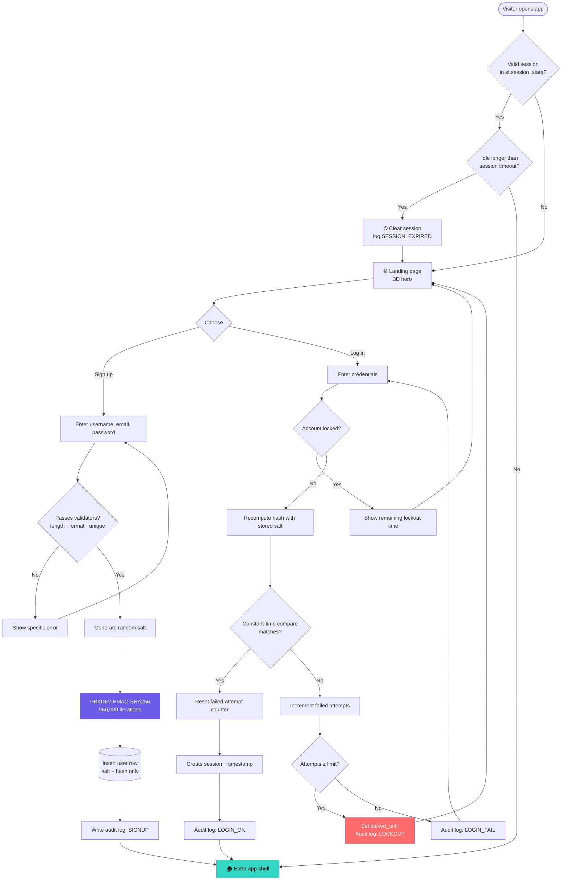
```mermaid
flowchart TD
    A(["Visitor opens app"]) --> B{"Valid session<br/>in st.session_state?"}
    B -- Yes --> T{"Idle longer than<br/>session timeout?"}
    T -- Yes --> EXP["⏱ Clear session<br/>log SESSION_EXPIRED"] --> LP
    T -- No --> HOME["🏠 Enter app shell"]
    B -- No --> LP["🌐 Landing page<br/>3D hero"]

    LP --> C{"Choose"}
    C -- Sign up --> S1["Enter username, email, password"]
    S1 --> S2{"Passes validators?<br/>length · format · unique"}
    S2 -- No --> S1E["Show specific error"] --> S1
    S2 -- Yes --> S3["Generate random salt"]
    S3 --> S4["PBKDF2-HMAC-SHA256<br/>260,000 iterations"]
    S4 --> S5[("Insert user row<br/>salt + hash only")]
    S5 --> S6["Write audit log: SIGNUP"] --> HOME

    C -- Log in --> L1["Enter credentials"]
    L1 --> L2{"Account locked?"}
    L2 -- Yes --> L2E["Show remaining lockout time"] --> LP
    L2 -- No --> L3["Recompute hash with stored salt"]
    L3 --> L4{"Constant-time compare<br/>matches?"}
    L4 -- Yes --> L5["Reset failed-attempt counter"]
    L5 --> L6["Create session + timestamp"]
    L6 --> L7["Audit log: LOGIN_OK"] --> HOME
    L4 -- No --> L8["Increment failed attempts"]
    L8 --> L9{"Attempts ≥ limit?"}
    L9 -- Yes --> L10["Set locked_until<br/>Audit log: LOCKOUT"] --> LP
    L9 -- No --> L11["Audit log: LOGIN_FAIL"] --> L1

    style S4 fill:#6C5CE7,color:#fff
    style L10 fill:#ff6b6b,color:#fff
    style HOME fill:#34D6C4,color:#000
```

**Account state machine:**

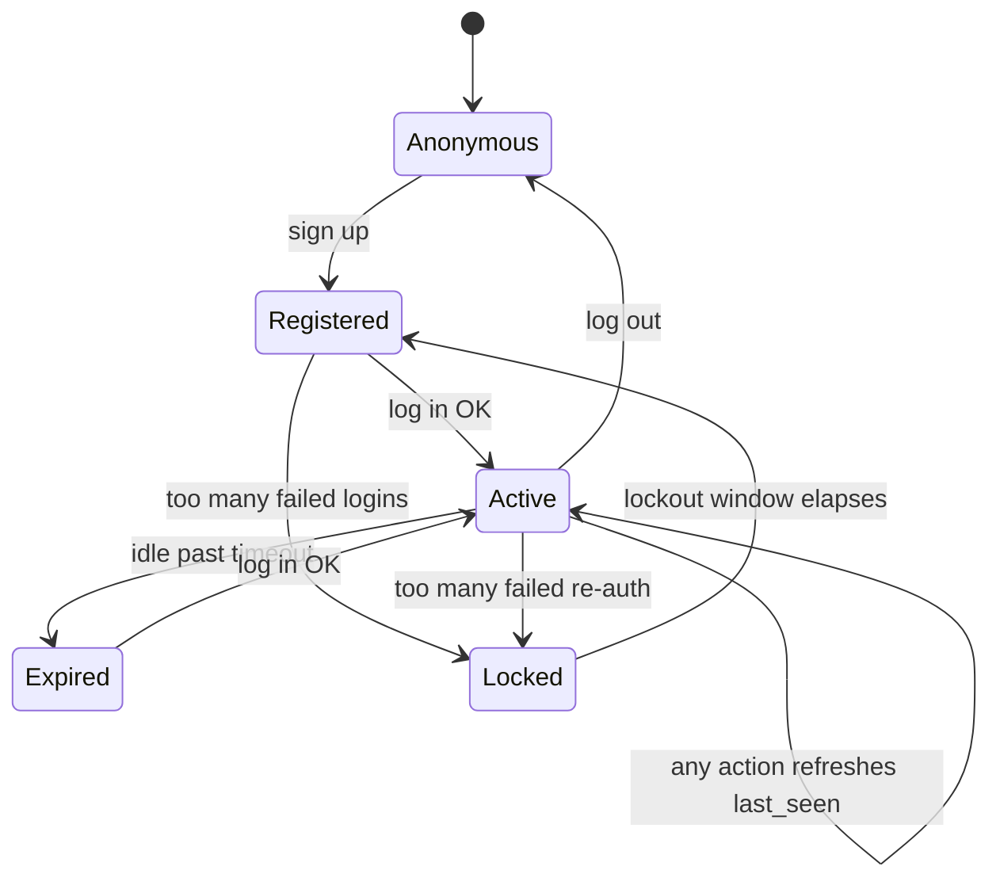
```mermaid
stateDiagram-v2
    [*] --> Anonymous
    Anonymous --> Registered: sign up
    Registered --> Active: log in OK
    Active --> Active: any action refreshes last_seen
    Active --> Expired: idle past timeout
    Expired --> Active: log in OK
    Registered --> Locked: too many failed logins
    Active --> Locked: too many failed re-auth
    Locked --> Registered: lockout window elapses
    Active --> Anonymous: log out
```

</details>

### 📂 Upload & Clean pipeline

<details open>
<summary><b>▶ From raw file to analysis-ready DataFrame</b></summary>

**What happens:** the loader detects the file type, sniffs the text encoding for CSVs (so a Latin-1 export doesn't crash), infers dtypes (including dates stored as strings) and hands the result to the cleaner. The cleaner offers three families of fixes (duplicates, missing values, and outliers) and records a snapshot before every action so **Undo** can restore it.

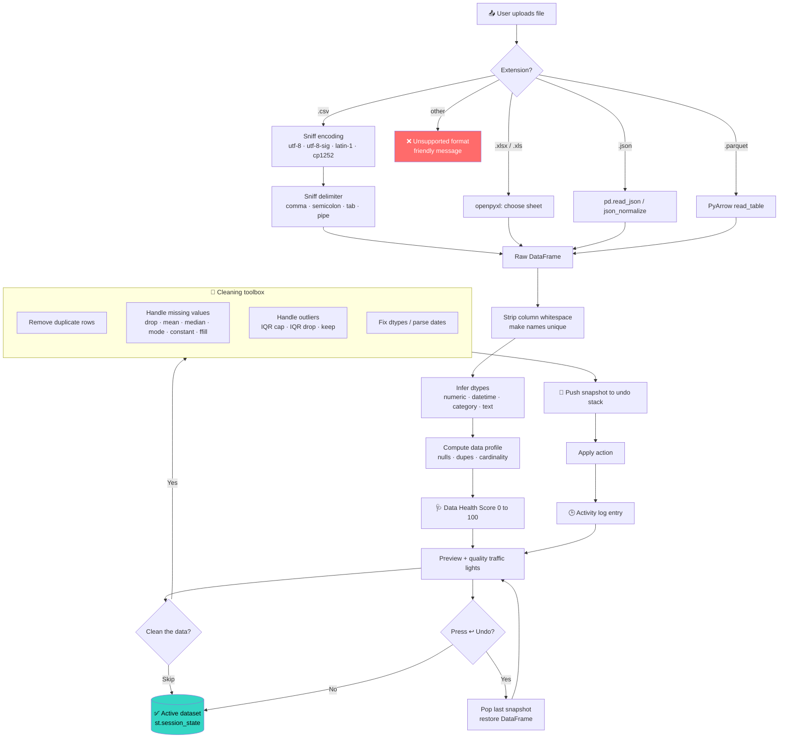
```mermaid
flowchart TD
    U["📤 User uploads file"] --> T{"Extension?"}
    T -- ".csv" --> C1["Sniff encoding<br/>utf-8 · utf-8-sig · latin-1 · cp1252"]
    C1 --> C2["Sniff delimiter<br/>comma · semicolon · tab · pipe"]
    T -- ".xlsx / .xls" --> X1["openpyxl: choose sheet"]
    T -- ".json" --> J1["pd.read_json / json_normalize"]
    T -- ".parquet" --> P1["PyArrow read_table"]
    T -- "other" --> ERR["❌ Unsupported format<br/>friendly message"]

    C2 --> DF["Raw DataFrame"]
    X1 --> DF
    J1 --> DF
    P1 --> DF

    DF --> I1["Strip column whitespace<br/>make names unique"]
    I1 --> I2["Infer dtypes<br/>numeric · datetime · category · text"]
    I2 --> I3["Compute data profile<br/>nulls · dupes · cardinality"]
    I3 --> HS["🩺 Data Health Score 0 to 100"]
    HS --> SHOW["Preview + quality traffic lights"]

    SHOW --> Q{"Clean the data?"}
    Q -- Skip --> ACT
    Q -- Yes --> CL

    subgraph CL["🧹 Cleaning toolbox"]
        direction TB
        D1["Remove duplicate rows"]
        D2["Handle missing values<br/>drop · mean · median · mode · constant · ffill"]
        D3["Handle outliers<br/>IQR cap · IQR drop · keep"]
        D4["Fix dtypes / parse dates"]
    end

    CL --> SNAP["📸 Push snapshot to undo stack"]
    SNAP --> APPLY["Apply action"]
    APPLY --> LOG["🕒 Activity log entry"]
    LOG --> SHOW

    SHOW --> UNDO{"Press ↩️ Undo?"}
    UNDO -- Yes --> POP["Pop last snapshot<br/>restore DataFrame"] --> SHOW
    UNDO -- No --> ACT[("✅ Active dataset<br/>st.session_state")]

    style ACT fill:#34D6C4,color:#000
    style ERR fill:#ff6b6b,color:#fff
```

#### 🩺 How the Data Health Score is built

The 0 to 100 score summarises how analysis-ready a dataset is. It is a weighted blend of four penalties, each normalised to 0 to 1:

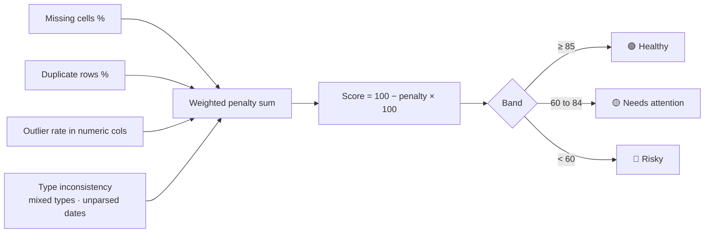
```mermaid
flowchart LR
    M["Missing cells %"] --> W
    D["Duplicate rows %"] --> W
    O["Outlier rate in numeric cols"] --> W
    T["Type inconsistency<br/>mixed types · unparsed dates"] --> W
    W["Weighted penalty sum"] --> S["Score = 100 − penalty × 100"]
    S --> B{"Band"}
    B -- "≥ 85" --> G["🟢 Healthy"]
    B -- "60 to 84" --> Y["🟡 Needs attention"]
    B -- "< 60" --> R["🔴 Risky"]
```

> The exact weights live in `modules/extra_features.py`. Adjust them to fit your domain.

#### 🚦 Per-column traffic lights

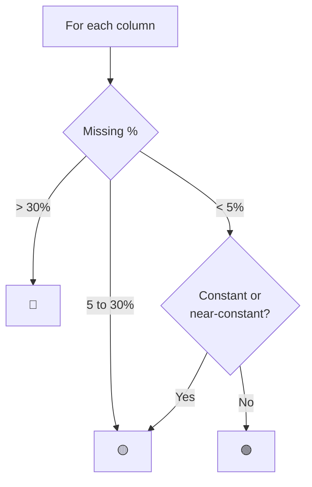
```mermaid
flowchart TD
    COL["For each column"] --> N{"Missing %"}
    N -- "> 30%" --> RED["🔴"]
    N -- "5 to 30%" --> YEL["🟡"]
    N -- "< 5%" --> CK{"Constant or<br/>near-constant?"}
    CK -- Yes --> YEL
    CK -- No --> GRN["🟢"]
```

</details>

### 🔗 Combine / Join

<details>
<summary><b>▶ Joining loaded files</b></summary>

**What happens:** you pick a left file, a right file, a join key on each side, and a join type. VERIDEXA checks key compatibility *before* joining so you don't silently produce a Cartesian explosion.

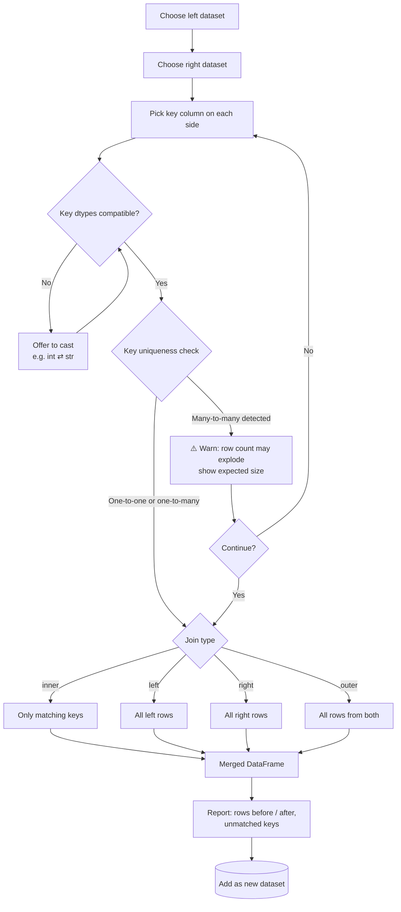
```mermaid
flowchart TD
    A["Choose left dataset"] --> B["Choose right dataset"]
    B --> C["Pick key column on each side"]
    C --> D{"Key dtypes compatible?"}
    D -- No --> D1["Offer to cast<br/>e.g. int ⇄ str"] --> D
    D -- Yes --> E{"Key uniqueness check"}
    E -- "Many-to-many detected" --> W["⚠️ Warn: row count may explode<br/>show expected size"]
    E -- "One-to-one or one-to-many" --> F
    W --> OK{"Continue?"}
    OK -- No --> C
    OK -- Yes --> F{"Join type"}
    F -- inner --> J1["Only matching keys"]
    F -- left --> J2["All left rows"]
    F -- right --> J3["All right rows"]
    F -- outer --> J4["All rows from both"]
    J1 --> R["Merged DataFrame"]
    J2 --> R
    J3 --> R
    J4 --> R
    R --> S["Report: rows before / after,<br/>unmatched keys"]
    S --> ACT[("Add as new dataset")]
```

| Join | Keeps | Use when |
|---|---|---|
| inner | Only keys present in both | You need complete records only |
| left | Everything from the left file | Left is your "master" table (e.g. orders) |
| right | Everything from the right file | Right is the master table |
| outer | Everything from both | Auditing which keys don't match |

</details>

### 💾 Persistent storage

<details>
<summary><b>▶ Saving, pinning, cloning and diffing datasets</b></summary>

**What happens:** a dataset is serialised to Parquet bytes in memory and stored as a BLOB in SQLite, keyed to your account. Parquet keeps dtypes intact (dates stay dates) and compresses well.

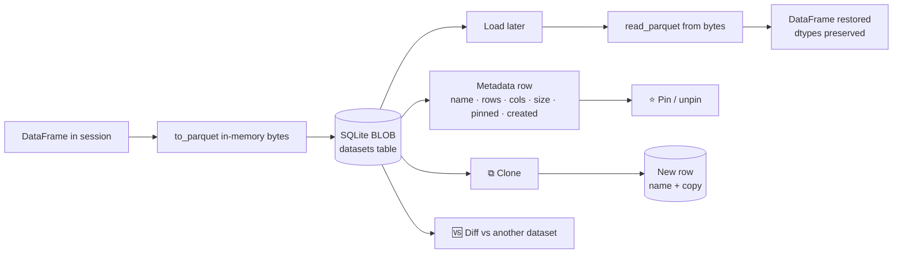
```mermaid
flowchart LR
    DF["DataFrame in session"] --> PQ["to_parquet in-memory bytes"]
    PQ --> BL[("SQLite BLOB<br/>datasets table")]
    BL --> META["Metadata row<br/>name · rows · cols · size · pinned · created"]

    BL --> LOADQ["Load later"] --> RD["read_parquet from bytes"] --> DF2["DataFrame restored<br/>dtypes preserved"]
    META --> PIN["⭐ Pin / unpin"]
    BL --> CLONE["⧉ Clone"] --> BL2[("New row<br/>name + copy")]
    BL --> DIFF["🆚 Diff vs another dataset"]
```

**Dataset diff, what is compared:**

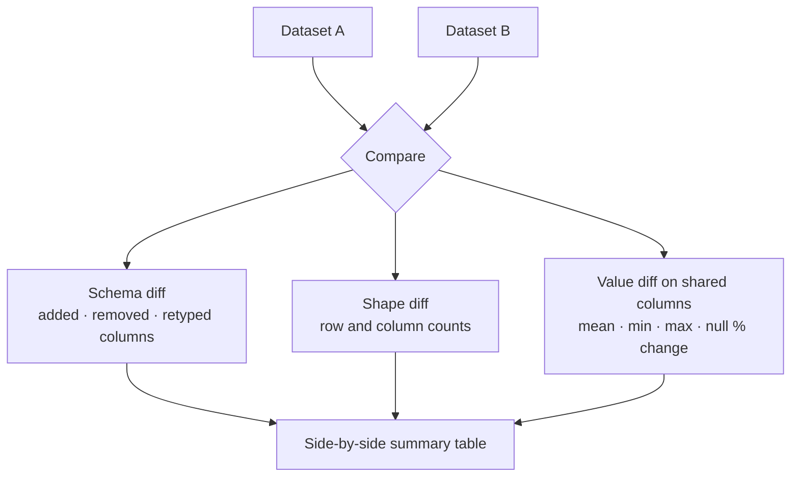
```mermaid
flowchart TD
    A["Dataset A"] --> CMP
    B["Dataset B"] --> CMP
    CMP{"Compare"} --> S1["Schema diff<br/>added · removed · retyped columns"]
    CMP --> S2["Shape diff<br/>row and column counts"]
    CMP --> S3["Value diff on shared columns<br/>mean · min · max · null % change"]
    S1 --> OUT["Side-by-side summary table"]
    S2 --> OUT
    S3 --> OUT
```

</details>

### 🔍 Data Explorer

<details>
<summary><b>▶ What each tab shows</b></summary>

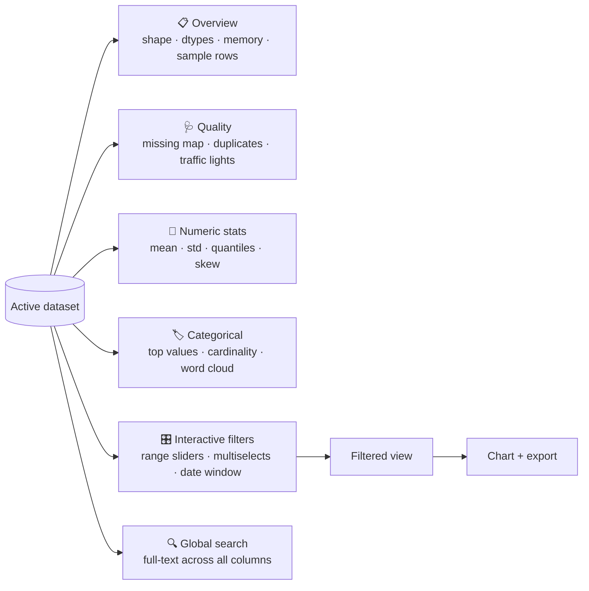
```mermaid
flowchart LR
    DS[("Active dataset")] --> T1["📋 Overview<br/>shape · dtypes · memory · sample rows"]
    DS --> T2["🩺 Quality<br/>missing map · duplicates · traffic lights"]
    DS --> T3["🔢 Numeric stats<br/>mean · std · quantiles · skew"]
    DS --> T4["🏷 Categorical<br/>top values · cardinality · word cloud"]
    DS --> T5["🎛 Interactive filters<br/>range sliders · multiselects · date window"]
    DS --> T6["🔍 Global search<br/>full-text across all columns"]
    T5 --> FDF["Filtered view"] --> CH["Chart + export"]
```

**Global row search** lowercases every cell (as text) and matches your query as a substring, so searching `"north"` finds rows where *any* column contains it.

</details>

### 📊 Dashboard auto-adaptation

<details open>
<summary><b>▶ How the dashboard decides what to show</b></summary>

**What happens:** the dashboard doesn't use a fixed template. It scans column names and dtypes, assigns each column a **semantic role**, and then builds only the KPI cards and charts the roles make possible.

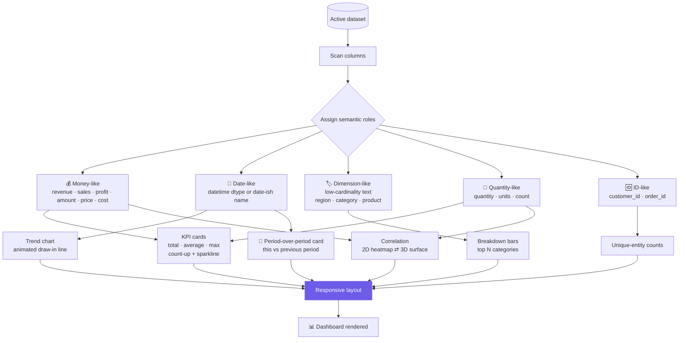
```mermaid
flowchart TD
    DS[("Active dataset")] --> SCAN["Scan columns"]
    SCAN --> ROLE{"Assign semantic roles"}

    ROLE --> R1["💰 Money-like<br/>revenue · sales · profit · amount · price · cost"]
    ROLE --> R2["📅 Date-like<br/>datetime dtype or date-ish name"]
    ROLE --> R3["🏷 Dimension-like<br/>low-cardinality text<br/>region · category · product"]
    ROLE --> R4["🔢 Quantity-like<br/>quantity · units · count"]
    ROLE --> R5["🆔 ID-like<br/>customer_id · order_id"]

    R1 --> K["KPI cards<br/>total · average · max<br/>count-up + sparkline"]
    R2 --> TR["Trend chart<br/>animated draw-in line"]
    R2 --> POP["📐 Period-over-period card<br/>this vs previous period"]
    R3 --> BR["Breakdown bars<br/>top N categories"]
    R4 --> K
    R5 --> CNT["Unique-entity counts"]
    R1 --> CORR["Correlation<br/>2D heatmap ⇄ 3D surface"]
    R4 --> CORR

    K --> LAYOUT["Responsive layout"]
    TR --> LAYOUT
    POP --> LAYOUT
    BR --> LAYOUT
    CNT --> LAYOUT
    CORR --> LAYOUT
    LAYOUT --> OUT["📊 Dashboard rendered"]

    style LAYOUT fill:#6C5CE7,color:#fff
```

#### 📐 Period-over-period card

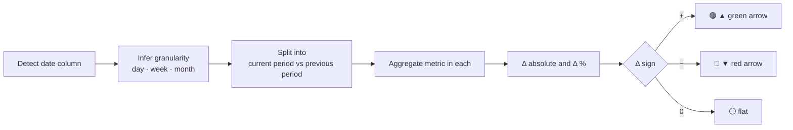
```mermaid
flowchart LR
    A["Detect date column"] --> B["Infer granularity<br/>day · week · month"]
    B --> C["Split into<br/>current period vs previous period"]
    C --> D["Aggregate metric in each"]
    D --> E["Δ absolute and Δ %"]
    E --> F{"Δ sign"}
    F -- "+" --> G["🟢 ▲ green arrow"]
    F -- "−" --> H["🔴 ▼ red arrow"]
    F -- "0" --> I["⚪ flat"]
```

#### 🔢 Count-up KPI animation + compact formatting

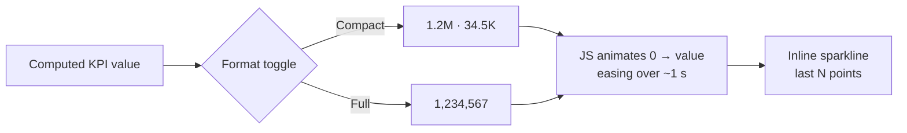
```mermaid
flowchart LR
    V["Computed KPI value"] --> FMT{"Format toggle"}
    FMT -- Compact --> C1["1.2M · 34.5K"]
    FMT -- Full --> C2["1,234,567"]
    C1 --> ANI["JS animates 0 → value<br/>easing over ~1 s"]
    C2 --> ANI
    ANI --> SPK["Inline sparkline<br/>last N points"]
```

</details>

### 🧪 Automated EDA

<details>
<summary><b>▶ What the EDA generator runs</b></summary>

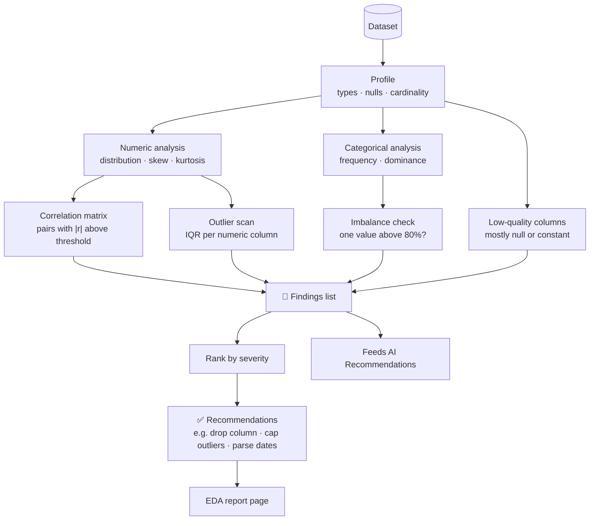
```mermaid
flowchart TD
    DS[("Dataset")] --> P["Profile<br/>types · nulls · cardinality"]
    P --> N["Numeric analysis<br/>distribution · skew · kurtosis"]
    P --> C["Categorical analysis<br/>frequency · dominance"]
    N --> COR["Correlation matrix<br/>pairs with |r| above threshold"]
    N --> OUT1["Outlier scan<br/>IQR per numeric column"]
    C --> IMB["Imbalance check<br/>one value above 80%?"]
    P --> LOWQ["Low-quality columns<br/>mostly null or constant"]

    COR --> FIND["📝 Findings list"]
    OUT1 --> FIND
    IMB --> FIND
    LOWQ --> FIND
    FIND --> RK["Rank by severity"]
    RK --> RECS["✅ Recommendations<br/>e.g. drop column · cap outliers · parse dates"]
    RECS --> UIOUT["EDA report page"]
    FIND --> REC["Feeds AI Recommendations"]
```

</details>

### 🤖 AI Analyst in depth

<details open>
<summary><b>▶ Plan → validate → execute → narrate</b></summary>

This is the heart of VERIDEXA. The key idea: **the question is converted into a structured `QueryPlan` (data), not into code.** The plan is validated, then a fixed set of Pandas routines executes it. There is no `eval`, no `exec`, and no generated code.

#### 1. Intent routing

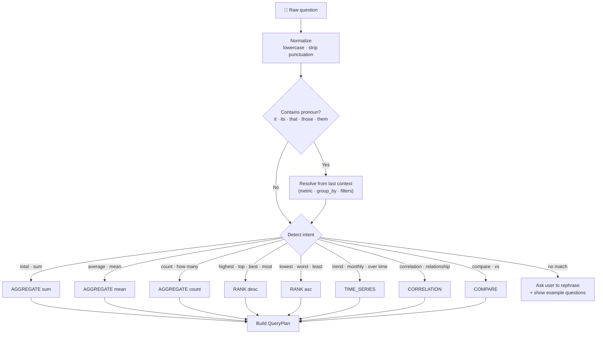
```mermaid
flowchart TD
    Q["💬 Raw question"] --> NORM["Normalize<br/>lowercase · strip punctuation"]
    NORM --> FU{"Contains pronoun?<br/>it · its · that · those · them"}
    FU -- Yes --> RES["Resolve from last context<br/>(metric · group_by · filters)"]
    FU -- No --> INT
    RES --> INT{"Detect intent"}

    INT -- "total · sum" --> I1["AGGREGATE sum"]
    INT -- "average · mean" --> I2["AGGREGATE mean"]
    INT -- "count · how many" --> I3["AGGREGATE count"]
    INT -- "highest · top · best · most" --> I4["RANK desc"]
    INT -- "lowest · worst · least" --> I5["RANK asc"]
    INT -- "trend · monthly · over time" --> I6["TIME_SERIES"]
    INT -- "correlation · relationship" --> I7["CORRELATION"]
    INT -- "compare · vs" --> I8["COMPARE"]
    INT -- "no match" --> I9["Ask user to rephrase<br/>+ show example questions"]

    I1 --> PLAN["Build QueryPlan"]
    I2 --> PLAN
    I3 --> PLAN
    I4 --> PLAN
    I5 --> PLAN
    I6 --> PLAN
    I7 --> PLAN
    I8 --> PLAN
```

#### 2. Column matching and validation

Words in the question are fuzzily matched against real column names. Whatever the matcher proposes is **re-checked against the live DataFrame immediately before execution**, so a stale or hallucinated column name cannot get through.

```mermaid
flowchart TD
    PLAN["QueryPlan<br/>metric · group_by · agg · filters · limit"] --> M["Map words to columns<br/>exact → synonym → fuzzy match"]
    M --> V{"Every referenced column<br/>in df.columns RIGHT NOW?"}
    V -- No --> ERR["Friendly error<br/>'I couldn't find a column like X'<br/>+ list closest matches"]
    V -- Yes --> T{"Types make sense?<br/>numeric metric · valid group_by"}
    T -- No --> ERR2["Explain the type problem<br/>suggest a valid column"]
    T -- Yes --> OK["✅ Validated plan"]
    OK --> EX["execute_plan"]
    style V fill:#6C5CE7,color:#fff
    style EX fill:#34D6C4,color:#000
```

#### 3. Execution: the only place numbers appear

```mermaid
flowchart TD
    EX["execute_plan(df, plan)"] --> F{"Filters present?"}
    F -- Yes --> F1["df = df.loc[mask]"]
    F -- No --> G
    F1 --> G{"group_by present?"}
    G -- Yes --> G1["df.groupby(group_by)[metric].agg(agg)"]
    G -- No --> G2["df[metric].agg(agg)"]
    G1 --> S{"Sort / limit?"}
    S -- Yes --> S1["sort_values · head(N)"]
    S -- No --> RES
    S1 --> RES["Result object<br/>table + scalars + metadata"]
    G2 --> RES
    RES --> CTX["Save to context<br/>for follow-ups"]
    style RES fill:#34D6C4,color:#000
```

#### 4. Narration

The narrator receives **only** the result object. It fills a four-part template:

```mermaid
flowchart LR
    RES["Computed result"] --> A["🔎 Finding<br/>what the number is"]
    RES --> B["📖 Explanation<br/>how it was computed"]
    RES --> C["💼 Business impact<br/>why it matters"]
    RES --> D["✅ Recommendation<br/>what to do next"]
    A --> OUT["Answer card"]
    B --> OUT
    C --> OUT
    D --> OUT
    OUT --> CH["📊 + auto-picked chart"]
```

#### 5. Optional LLM rephrasing (never required)

```mermaid
flowchart TD
    N["Template narration<br/>numbers already fixed"] --> K{"LLM provider configured<br/>in .env?"}
    K -- No --> OUT["Show template text<br/>✅ fully functional"]
    K -- Yes --> P["Send ONLY the narration + numbers<br/>prompt: 'rephrase, do not change any number'"]
    P --> LLM["Groq · OpenAI · Anthropic · Ollama"]
    LLM --> CHK{"Every number in output<br/>appears in the computed set?"}
    CHK -- Yes --> SHOW["Show rephrased text"]
    CHK -- "No / error / timeout" --> FALL["Fallback to template text"] --> OUT
    style CHK fill:#6C5CE7,color:#fff
```

> Safety net: the rephrase is accepted only if every numeric token in it matches a number from the computed result. Otherwise VERIDEXA silently falls back to the template.

#### 6. Follow-up resolution

```mermaid
sequenceDiagram
    actor U as User
    participant AN as AI Analyst
    participant CX as Context store

    U->>AN: "Top 5 category by revenue"
    AN->>CX: save metric=revenue, group_by=category, intent=RANK
    AN-->>U: table + chart

    U->>AN: "what about its monthly trend?"
    AN->>CX: read last context
    CX-->>AN: metric=revenue, group_by=category
    Note over AN: "its" → revenue<br/>"monthly trend" → TIME_SERIES by month
    AN-->>U: monthly revenue trend
```

</details>

### 📈 Forecasting model selection

<details open>
<summary><b>▶ Linear trend vs Holt-Winters seasonal</b></summary>

**What happens:** you choose a date column, a numeric target, an aggregation frequency and a horizon. VERIDEXA prepares an evenly spaced series and fits either an OLS line or a seasonal Holt-Winters model, then draws the forecast with a confidence band.

```mermaid
flowchart TD
    S["Select date column + target + horizon"] --> R["Resample to fixed frequency<br/>D · W · M"]
    R --> FILL["Fill gaps<br/>interpolate or zero"]
    FILL --> LEN{"Enough history?<br/>≥ 2 full seasonal cycles"}

    LEN -- No --> LIN
    LEN -- Yes --> CH{"User model choice"}
    CH -- "Auto" --> TEST{"Seasonality detected?<br/>autocorrelation at lag m"}
    TEST -- No --> LIN
    TEST -- Yes --> HW
    CH -- "Linear" --> LIN
    CH -- "Seasonal" --> HW

    subgraph LIN["📉 OLS linear trend"]
        direction TB
        L1["Fit y = a + b·t"] --> L2["Residual std σ"] --> L3["Band = ŷ ± z·σ"]
    end

    subgraph HW["🌊 Holt-Winters"]
        direction TB
        H1["Fit level + trend + seasonal"] --> H2["Forecast horizon steps"] --> H3["Band from simulated / residual error"]
    end

    LIN --> OUT
    HW --> OUT
    OUT["Forecast table + confidence band"] --> DEC["📉 Decomposition view<br/>trend · seasonal · residual"]
    OUT --> CHRT["Animated chart<br/>history solid · forecast dashed"]
    OUT --> REC["Feeds AI Recommendations"]
```

| Model | Best for | Needs | Weakness |
|---|---|---|---|
| OLS linear | Steady growth/decline, short history | ≥ ~3 points | Ignores seasonality |
| Holt-Winters | Repeating weekly / monthly / yearly patterns | ≥ 2 full cycles | Can overfit short series |

</details>

### 🚨 Anomaly detection (IQR)

<details open>
<summary><b>▶ How a value gets flagged, scored and explained</b></summary>

**What happens:** for a numeric column, VERIDEXA computes the interquartile range and flags values far outside the "normal" band. Each flag gets a **risk level** based on *how far* outside it is, and a **plain-language reason**.

```mermaid
flowchart TD
    C["Choose numeric column"] --> Q["Q1 = 25th percentile<br/>Q3 = 75th percentile"]
    Q --> IQR["IQR = Q3 − Q1"]
    IQR --> FENCE["Lower fence = Q1 − k·IQR<br/>Upper fence = Q3 + k·IQR<br/>default k = 1.5"]
    FENCE --> EACH["For each value x"]
    EACH --> T{"x outside fences?"}
    T -- No --> OKV["Normal"]
    T -- Yes --> DIST["distance = how many IQRs beyond the fence"]
    DIST --> RISK{"Risk level"}
    RISK -- "< 1 IQR beyond" --> LOW["🟡 Low"]
    RISK -- "1 to 3 IQR beyond" --> MED["🟠 Medium"]
    RISK -- "> 3 IQR beyond" --> HIGH["🔴 High"]
    LOW --> WHY
    MED --> WHY
    HIGH --> WHY["Reason text<br/>'Value 9,400 is 4.2× above the upper fence 2,100'"]
    WHY --> TBL["Anomaly table<br/>row · value · risk · reason"]
    TBL --> PLOT["Scatter with flagged points highlighted"]
    TBL --> ACTION{"What next?"}
    ACTION --> CAP["Cap in Cleaner"]
    ACTION --> INV["Investigate rows"]
    ACTION --> REC["Feeds AI Recommendations"]
```

</details>

### 👥 Customer segmentation

<details open>
<summary><b>▶ RFM rules or K-Means (2D / 3D)</b></summary>

```mermaid
flowchart TD
    START["Choose method"] --> M{"Method"}

    M -- "RFM" --> RF1["Map columns<br/>customer_id · order_date · amount"]
    RF1 --> RF2["Recency = days since last order<br/>Frequency = number of orders<br/>Monetary = total spend"]
    RF2 --> RF3["Score each 1 to 5 by quantile"]
    RF3 --> RF4{"Rule-based labels"}
    RF4 --> L1["🏆 Champions<br/>high R, F, M"]
    RF4 --> L2["💙 Loyal"]
    RF4 --> L3["🌱 Potential / New"]
    RF4 --> L4["⚠️ At risk<br/>was good, now quiet"]
    RF4 --> L5["💤 Lost"]

    M -- "K-Means" --> K1["Pick 2+ numeric features"]
    K1 --> K2["StandardScaler<br/>so units don't dominate"]
    K2 --> K3["Choose k<br/>manual or elbow / silhouette"]
    K3 --> K4["Fit KMeans"]
    K4 --> K5{"Number of features"}
    K5 -- "2" --> K6["2D scatter"]
    K5 -- "3 or more" --> K7["🧊 Rotating 3D scatter<br/>top 3 features or PCA"]
    K4 --> K8["Cluster profile table<br/>size · mean per feature"]

    L1 --> OUT["Segment summary + sizes"]
    L2 --> OUT
    L3 --> OUT
    L4 --> OUT
    L5 --> OUT
    K6 --> OUT
    K7 --> OUT
    K8 --> OUT
    OUT --> REC["Feeds AI Recommendations<br/>e.g. 'Win-back campaign for At-risk'"]
```

</details>

### 💡 AI Recommendations

<details>
<summary><b>▶ How prioritised actions are assembled</b></summary>

The recommendation engine doesn't compute new numbers. It *reads* the results of modules you've already run in this session and turns them into ranked actions.

```mermaid
flowchart TD
    subgraph IN["Session results available"]
        direction LR
        E["EDA findings"]
        F["Forecast slope / change"]
        A["Anomaly counts + risk"]
        S["Segment sizes"]
        H["Health score"]
    end

    IN --> RULES["Rule table<br/>IF condition THEN action"]
    RULES --> CAND["Candidate actions"]
    CAND --> SC["Score = impact × confidence ÷ effort"]
    SC --> SORT["Sort descending"]
    SORT --> P1["🔥 High priority"]
    SORT --> P2["⚡ Medium"]
    SORT --> P3["🌿 Nice to have"]
    P1 --> UI["Recommendations page"]
    P2 --> UI
    P3 --> UI
    UI --> REPORT["Included in reports"]
```

**Examples of rules:** *"Forecast declining 3 periods in a row → investigate churn"*, *"Health score < 60 → run cleaner before trusting results"*, *"≥ 10% of customers in At-risk → launch re-engagement"*.

</details>

### 🧊 3D Explorer

<details>
<summary><b>▶ Three 3D views and how they are built</b></summary>

```mermaid
flowchart TD
    DS[("Dataset")] --> V{"Choose view"}

    V -- "3D scatter" --> S1["Pick X · Y · Z numeric<br/>optional color + size"]
    S1 --> S2["Plotly Scatter3d<br/>drag to orbit · scroll to zoom"]

    V -- "Correlation surface" --> C1["Compute correlation matrix"]
    C1 --> C2["Plotly Surface<br/>height = r value"]

    V -- "Density landscape" --> D1["Pick two numeric columns"]
    D1 --> D2["2D histogram / KDE grid"]
    D2 --> D3["Plotly Surface<br/>peaks = dense regions"]

    S2 --> OUT["Interactive 3D chart"]
    C2 --> OUT
    D3 --> OUT
    OUT --> EXP["💾 Export HTML  ·  📤 Export data CSV"]
```

**Landing-page hero (Three.js):**

```mermaid
flowchart LR
    A["Streamlit components.html"] --> B["Load Three.js"]
    B --> C["Scene: icosahedron + particle swarm"]
    C --> D["requestAnimationFrame loop"]
    D --> E["Auto-rotate"]
    D --> F["OrbitControls: drag to orbit"]
    D --> G["Resize observer"]
    C --> H{"WebGL available?"}
    H -- No --> I["Graceful static fallback"]
```

**Mouse-tilt cards:**

```mermaid
flowchart LR
    M["mousemove on card"] --> P["Compute cursor offset<br/>from card centre"]
    P --> R["rotateX / rotateY<br/>CSS perspective transform"]
    R --> SH["Move highlight + shadow"]
    L["mouseleave"] --> RS["Ease back to 0°"]
```

</details>

### 🎯 Auto chart picker / "Suggest best chart"

<details>
<summary><b>▶ Decision tree used to choose a chart</b></summary>

```mermaid
flowchart TD
    R["Result or selected columns"] --> Q1{"Contains a date axis?"}
    Q1 -- Yes --> LINE["📈 Line chart<br/>animated draw-in"]
    Q1 -- No --> Q2{"One categorical +<br/>one numeric?"}
    Q2 -- Yes --> Q3{"Categories ≤ 12?"}
    Q3 -- Yes --> BAR["📊 Bar chart<br/>▶ play-button bar race if time exists"]
    Q3 -- No --> TOP["📊 Horizontal bar of Top N"]
    Q2 -- No --> Q4{"Two numeric?"}
    Q4 -- Yes --> Q5{"Third numeric chosen?"}
    Q5 -- Yes --> S3D["🧊 3D scatter"]
    Q5 -- No --> SC["⚬ 2D scatter + trendline"]
    Q4 -- No --> Q6{"Single numeric?"}
    Q6 -- Yes --> HIST["📉 Histogram + box"]
    Q6 -- No --> Q7{"Single categorical?"}
    Q7 -- Yes --> PIE["🍩 Count bars<br/>or donut if ≤ 6 slices"]
    Q7 -- No --> TBL["📋 Table only"]
```

</details>

### 📄 Report generation

<details open>
<summary><b>▶ One click → CSV / Excel / HTML / PDF</b></summary>

```mermaid
flowchart TD
    CLICK["📄 Generate report"] --> COLLECT["Collect from session<br/>dataset profile · KPIs · charts<br/>EDA · forecast · anomalies · segments · recommendations"]
    COLLECT --> FMT{"Format"}

    FMT -- CSV --> C1["Current dataset or result table → CSV"]
    FMT -- Excel --> X1["openpyxl workbook<br/>one sheet per section<br/>formatted headers"]
    FMT -- HTML --> H1["Jinja-style HTML<br/>embedded Plotly charts<br/>standalone file"]
    FMT -- PDF --> P1["Render HTML template"]
    P1 --> P2["xhtml2pdf → native PDF<br/>static chart images"]

    C1 --> DL
    X1 --> DL
    H1 --> DL
    P2 --> DL["⬇️ Download button"]
    DL --> LOG["🕒 Activity log: REPORT_EXPORTED"]
    DL --> TOAST["🔔 Toast: 'Report ready'"]
```

</details>

### 🔔 Activity log, toasts and command palette

<details>
<summary><b>▶ Cross-cutting UX features</b></summary>

```mermaid
flowchart LR
    ACT["Any user action<br/>upload · clean · query · export · login"] --> LG["logger.py"]
    LG --> F1["logs/ file"]
    LG --> F2[("audit_log table")]
    F2 --> PG["🕒 Activity Log page<br/>filter by action · date"]
    ACT --> TOAST["🔔 Toast notification"]

    KB["⌘K / Ctrl+K"] --> PAL["🔎 Command palette"]
    PAL --> FZ["Fuzzy match page names"]
    FZ --> NAV["Jump to page"]
```

**Theme toggle:**

```mermaid
flowchart LR
    T["🌓 Toggle"] --> S["Store theme in session_state"]
    S --> CSS["Inject CSS variables"]
    S --> PL["Switch Plotly template<br/>plotly_dark ⇄ plotly_white"]
    CSS --> UI["Re-render"]
    PL --> UI
```

</details>

---

## 🗃 Data model

<details>
<summary><b>▶ SQLite schema (ER diagram)</b></summary>

```mermaid
erDiagram
    USERS ||--o{ DATASETS : owns
    USERS ||--o{ AUDIT_LOG : generates
    USERS ||--o{ SESSIONS : opens

    USERS {
        int id PK
        string username UK
        string email UK
        blob password_hash
        blob salt
        int iterations
        int failed_attempts
        datetime locked_until
        datetime created_at
    }

    DATASETS {
        int id PK
        int user_id FK
        string name
        blob parquet_bytes
        int n_rows
        int n_cols
        bool pinned
        datetime created_at
    }

    AUDIT_LOG {
        int id PK
        int user_id FK
        string action
        string detail
        datetime ts
    }

    SESSIONS {
        string token PK
        int user_id FK
        datetime created_at
        datetime last_seen
    }
```

> Table and column names above describe the intended design. Match them to your actual `modules/db.py` if they differ.

</details>

<details>
<summary><b>▶ What lives in <code>st.session_state</code></b></summary>

```mermaid
flowchart TD
    SS(("st.session_state"))
    SS --> A["auth<br/>user · login time · last_seen"]
    SS --> B["datasets<br/>name → DataFrame"]
    SS --> C["active_dataset"]
    SS --> D["undo_stack<br/>list of DataFrame snapshots"]
    SS --> E["analyst_context<br/>last metric · group_by · filters"]
    SS --> F["chat_history"]
    SS --> G["results cache<br/>forecast · anomalies · segments · EDA"]
    SS --> H["ui<br/>theme · number format · current page"]
```

</details>

---

## 🚀 Quick start

```bash
python -m venv venv
source venv/bin/activate        # Windows: venv\Scripts\activate
pip install -r requirements.txt
streamlit run app.py
```

Open the URL Streamlit prints (usually `http://localhost:8501`) and create an account.

```mermaid
flowchart LR
    A["1️⃣ Create venv"] --> B["2️⃣ pip install -r requirements.txt"]
    B --> C["3️⃣ streamlit run app.py"]
    C --> D["4️⃣ Open localhost:8501"]
    D --> E["5️⃣ Sign up"]
    E --> F["6️⃣ Upload a CSV"]
    F --> G["7️⃣ Ask your first question 🎉"]
```

<details>
<summary><b>▶ Optional: enable LLM rephrasing</b></summary>

```bash
cp .env.example .env   # then add a Groq / OpenAI / Anthropic key, or point at local Ollama
```

Fully optional. The app works without it. See the [LLM rephrasing flowchart](#-ai-analyst-in-depth) for how it is sandboxed.

</details>

<details>
<summary><b>▶ Run the tests</b></summary>

```bash
pytest
```

Covers the loader, profiler, query engine, forecasting, anomaly detection, segmentation, and auth. CI runs on Python 3.10 to 3.12.

</details>

<details>
<summary><b>▶ Try it with a sample file</b></summary>

Create `sales_sample.csv`:

```csv
order_id,order_date,region,category,quantity,revenue,profit,customer_id
1001,2025-01-05,North,Electronics,2,1200,300,C01
1002,2025-01-18,South,Furniture,1,450,90,C02
1003,2025-02-02,North,Electronics,3,1800,420,C03
1004,2025-02-20,East,Clothing,5,250,75,C01
1005,2025-03-11,West,Furniture,2,900,200,C04
1006,2025-03-29,South,Electronics,1,600,140,C02
```

Upload it, then try any question in the next section.

</details>

---

## ⚙️ Configuration

<details>
<summary><b>▶ Environment variables and settings</b></summary>

All settings are read from `config/settings.py`, which in turn reads `.env` if present.

| Variable | Default | Purpose |
|---|---|---|
| `SESSION_TIMEOUT_MINUTES` | `30` | Idle time before auto-logout |
| `MAX_LOGIN_ATTEMPTS` | `5` | Failed logins before lockout |
| `LOCKOUT_MINUTES` | `15` | How long the lockout lasts |
| `PBKDF2_ITERATIONS` | `260000` | Password hashing cost |
| `MAX_UPLOAD_MB` | `200` | Upload size cap |
| `DB_PATH` | `data/veridexa.db` | SQLite file location |
| `LLM_PROVIDER` | *(empty)* | `groq`, `openai`, `anthropic`, `ollama`, or empty to disable |
| `GROQ_API_KEY` / `OPENAI_API_KEY` / `ANTHROPIC_API_KEY` | *(empty)* | Only for optional rephrasing |
| `OLLAMA_HOST` | `http://localhost:11434` | Local model endpoint |

> Variable names and defaults are illustrative. Keep this table in sync with your real `settings.py` and `.env.example`.

```mermaid
flowchart LR
    ENV[".env file"] --> ST["config/settings.py"]
    OS["OS environment"] --> ST
    DEF["Built-in defaults"] --> ST
    ST --> AUTHM["auth.py"]
    ST --> DBM["db.py"]
    ST --> LDR["data_loader.py"]
    ST --> AIM["ai_analyzer.py"]
```

Precedence: OS environment → `.env` → built-in defaults.

</details>

---

## 💬 Try these questions

<details open>
<summary><b>▶ Click to copy ideas into the AI Analyst</b></summary>

```text
What is the total revenue?
Which region generated the highest revenue?
What is the monthly revenue trend?
Is there a correlation between quantity and profit?
Average profit
Top 5 category by revenue
what about its monthly trend?        ← follow-up, resolves "its"
```

**What each one triggers internally:**

| Question | Intent | Plan (simplified) | Chart |
|---|---|---|---|
| What is the total revenue? | AGGREGATE | `sum(revenue)` | KPI card |
| Which region generated the highest revenue? | RANK desc | `groupby(region).sum(revenue).head(1)` | Bar |
| What is the monthly revenue trend? | TIME_SERIES | `resample("M").sum(revenue)` | Line |
| Is there a correlation between quantity and profit? | CORRELATION | `corr(quantity, profit)` | Scatter + trendline |
| Average profit | AGGREGATE | `mean(profit)` | KPI card |
| Top 5 category by revenue | RANK desc | `groupby(category).sum(revenue).head(5)` | Bar |
| what about its monthly trend? | TIME_SERIES + context | metric/group from previous turn | Line |

</details>

---

## 🧱 Tech stack

| Layer | Technology |
|---|---|
| Frontend | Streamlit + Three.js (landing hero) |
| Data | Pandas, NumPy, PyArrow |
| Visualization | Plotly (2D, 3D, animated frames) |
| ML / Forecasting | scikit-learn, NumPy OLS, statsmodels Holt-Winters |
| Auth + storage | SQLite (WAL), stdlib `hashlib` PBKDF2 |
| Export | HTML, Excel (openpyxl), PDF (xhtml2pdf) |
| Testing / CI | pytest, GitHub Actions |

```mermaid
flowchart LR
    ST["Streamlit"] --> PD["Pandas / NumPy"]
    ST --> PL["Plotly"]
    ST --> TJ["Three.js"]
    PD --> PA["PyArrow / Parquet"]
    PD --> SK["scikit-learn<br/>KMeans · scaling"]
    PD --> SM["statsmodels<br/>Holt-Winters"]
    PA --> SQ[("SQLite WAL")]
    ST --> HL["hashlib PBKDF2"]
    HL --> SQ
    PL --> EX["HTML export"]
    PD --> OX["openpyxl → Excel"]
    EX --> XP["xhtml2pdf → PDF"]
```

---

## 🗂 Project structure

<details>
<summary><b>▶ Expand the tree</b></summary>

```text
VERIDEXA/
├── app.py                     # Entry point: auth gate, sidebar, page routing
├── config/settings.py
├── modules/
│   ├── auth.py / db.py        # Accounts, audit log, saved datasets
│   ├── ui_auth.py             # 3D landing page + login / signup
│   ├── data_loader.py / data_cleaner.py / data_profiler.py
│   ├── dashboard.py           # Animated KPIs, 3D toggles, period-over-period
│   ├── query_engine.py        # ⭐ The only place a number is computed
│   ├── insight_generator.py / ai_analyzer.py
│   ├── eda_generator.py / forecasting.py / anomaly_detection.py
│   ├── segmentation.py / recommendation_engine.py
│   ├── report_generator.py
│   ├── visualization.py       # 2D, 3D and animated Plotly builders
│   └── extra_features.py      # Health score, word cloud, diff, sparklines…
├── utils/                     # logger, validators, helpers
├── tests/
└── logs/
```

</details>

<details>
<summary><b>▶ What each file is responsible for</b></summary>

| File | Responsibility | Computes numbers? |
|---|---|---|
| `app.py` | Auth gate, sidebar navigation, page router, theme | No |
| `config/settings.py` | Central settings and env loading | No |
| `modules/auth.py` | Hashing, verification, lockout, session timeout | No |
| `modules/db.py` | SQLite connection (WAL), schema, CRUD, audit log | No |
| `modules/ui_auth.py` | Landing page with Three.js hero, login/signup forms | No |
| `modules/data_loader.py` | File type detection, encoding sniffing, dtype inference | No |
| `modules/data_cleaner.py` | Dupes / missing / outliers, undo snapshots | Transforms data |
| `modules/data_profiler.py` | Column-level profile used across the app | Descriptive stats |
| `modules/dashboard.py` | Role detection, KPI + chart layout | Calls `query_engine` |
| `modules/query_engine.py` | **`build_plan`, validation, `execute_plan`** | ✅ **Yes, the only one for Q&A** |
| `modules/insight_generator.py` | Turns results into Finding / Explanation / Impact / Recommendation | No |
| `modules/ai_analyzer.py` | Chat orchestration, follow-up context, optional LLM rephrase | No |
| `modules/eda_generator.py` | Automated EDA findings | Descriptive stats |
| `modules/forecasting.py` | OLS and Holt-Winters | Model outputs |
| `modules/anomaly_detection.py` | IQR flags, risk, reason | Fence maths |
| `modules/segmentation.py` | RFM and K-Means | Cluster outputs |
| `modules/recommendation_engine.py` | Rules over existing results | No |
| `modules/report_generator.py` | CSV / Excel / HTML / PDF assembly | No |
| `modules/visualization.py` | 2D, 3D, animated Plotly builders; chart picker | No |
| `modules/extra_features.py` | Health score, word cloud, diff, sparklines, search | Descriptive stats |
| `utils/` | Logging, input validators, small helpers | No |
| `tests/` | pytest suites per module | n/a |

</details>

---

## 🧪 Testing & CI

<details open>
<summary><b>▶ What is tested and how CI runs</b></summary>

```mermaid
flowchart LR
    PUSH["git push / pull request"] --> GH["GitHub Actions: ci.yml"]
    GH --> MAT{"Matrix"}
    MAT --> P10["Python 3.10"]
    MAT --> P11["Python 3.11"]
    MAT --> P12["Python 3.12"]
    P10 --> I["pip install -r requirements.txt"]
    P11 --> I
    P12 --> I
    I --> T["pytest"]
    T --> R{"All green?"}
    R -- Yes --> OK["✅ Badge passes"]
    R -- No --> FAIL["❌ Block merge"]
```

| Test area | What it protects |
|---|---|
| Loader | Encodings, delimiters, Excel sheets, dtype inference |
| Profiler | Null / duplicate / cardinality counts |
| Query engine | Plans validate; results equal hand-computed Pandas |
| Forecasting | Output length = horizon; bands contain the forecast |
| Anomaly detection | Known outliers flagged; clean data not flagged |
| Segmentation | RFM labels assigned; cluster count = k |
| Auth | Hash verify, wrong password, lockout, timeout |

**The "zero hallucinated numbers" guarantee in tests:**

```mermaid
flowchart TD
    T["Test: ask question"] --> A["Run through full pipeline"]
    A --> B["Independently compute expected value with plain Pandas"]
    B --> C{"Pipeline number == expected?"}
    C -- Yes --> P["✅ pass"]
    C -- No --> F["❌ fail"]
    A --> D["Extract numbers from narration"]
    D --> E{"Each appears in computed result?"}
    E -- Yes --> P
    E -- No --> F
```

</details>

---

## 🔒 Security notes

<details open>
<summary><b>▶ Read before deploying</b></summary>

- Passwords: PBKDF2-HMAC-SHA256, unique salt per user, 260,000 iterations.
- Every AI Analyst query re-validates each column name against the live DataFrame immediately before execution; no `eval`.
- This is a portfolio/demo app: the SQLite auth DB is local and unencrypted at rest, with no HTTPS or cookie hardening. Add those before storing real user data.

```mermaid
flowchart TD
    subgraph DONE["✅ Already in place"]
        direction TB
        D1["Salted PBKDF2 hashing"]
        D2["Login lockout"]
        D3["Session timeout"]
        D4["Audit log"]
        D5["No eval / exec on user text"]
        D6["Column re-validation before execute"]
        D7["Parameterised SQL"]
    end

    subgraph TODO["⚠️ Add before production"]
        direction TB
        T1["HTTPS via reverse proxy<br/>nginx · Caddy · Traefik"]
        T2["Encrypt DB at rest<br/>or move to managed Postgres"]
        T3["Secure, HttpOnly cookies"]
        T4["Role-based access control"]
        T5["Rate limiting"]
        T6["Upload scanning and size limits"]
        T7["Secrets manager for API keys"]
    end

    DONE --> TODO
```

**Threat model at a glance**

| Threat | Mitigation today | Still needed for production |
|---|---|---|
| Stolen DB file | Passwords are hashed, not stored | Encryption at rest |
| Brute-force login | Lockout + audit log | IP-level rate limiting |
| Prompt / code injection via question | Questions become a data `QueryPlan`; no code execution | None |
| LLM changing numbers | Output rejected if numbers don't match | None |
| Network sniffing | None | HTTPS |
| Malicious upload | Type check | Antivirus / sandbox, stricter limits |

</details>

---

## 🩹 Troubleshooting

<details>
<summary><b>▶ Common problems and fixes</b></summary>

```mermaid
flowchart TD
    P["Something is wrong"] --> Q{"Symptom"}

    Q -- "CSV shows garbled characters" --> A1["Try re-saving as UTF-8<br/>or pick encoding manually"]
    Q -- "Dates treated as text" --> A2["Use Fix dtypes → Parse dates<br/>choose the format"]
    Q -- "AI Analyst says column not found" --> A3["Check spelling in Explorer<br/>use the suggested closest column"]
    Q -- "Forecast looks flat" --> A4["Too little history or wrong frequency<br/>switch to Linear or change resample"]
    Q -- "3D hero is blank" --> A5["Enable WebGL in browser<br/>or update GPU drivers"]
    Q -- "PDF export fails" --> A6["Reinstall xhtml2pdf<br/>or export HTML and print to PDF"]
    Q -- "Locked out" --> A7["Wait for LOCKOUT_MINUTES<br/>or clear locked_until in DB"]
    Q -- "Port 8501 busy" --> A8["streamlit run app.py --server.port 8502"]
    Q -- "LLM rephrase not appearing" --> A9["Check .env key and provider<br/>app falls back to template by design"]
```

</details>

---

## ❓ FAQ

<details>
<summary><b>▶ Frequently asked questions</b></summary>

**Do I need an API key?**
No. Every feature works without one. A key only enables optional rephrasing of the final sentences.

**Can the AI Analyst be wrong?**
It can *misunderstand* a question (e.g. pick the wrong column), but it cannot *invent* a number: every number is a real Pandas result you can verify in the result table.

**How is this different from asking ChatGPT about my CSV?**
A chat LLM reads your data as text and predicts an answer. VERIDEXA converts your question to a structured plan and runs real code on the actual DataFrame.

**Where is my data stored?**
In the session (memory) while you work. If you click Save, it is stored locally as Parquet bytes in the SQLite file.

**Does my data leave my machine?**
Not unless you enable an external LLM provider, and even then only the already-computed narration text is sent, never your raw rows.

**How big a file can I load?**
Limited by RAM and `MAX_UPLOAD_MB`. For files above a few hundred MB, consider pre-aggregating or using the planned database connectors.

**Can I add my own question types?**
Yes, add an intent in `build_plan`, an executor branch in `execute_plan`, and a narration template. Because all numbers flow through `query_engine.py`, the guarantee is preserved.

```mermaid
flowchart LR
    A["1. Add intent keywords<br/>build_plan"] --> B["2. Add executor branch<br/>execute_plan"]
    B --> C["3. Add narration template<br/>insight_generator"]
    C --> D["4. Add chart rule<br/>visualization"]
    D --> E["5. Add pytest case<br/>compare with plain Pandas"]
```

</details>

---

## 🛣 Roadmap

- [x] Auth, upload, join, persistent storage
- [x] AI Analyst, forecasting, anomalies, segmentation, reports (CSV / Excel / HTML / PDF)
- [x] CI with pytest
- [x] 3D explorer, animated charts, activity log viewer
- [ ] External connectors (Google Sheets / Postgres / MySQL)
- [ ] Real LLM phrasing in `ai_analyzer.py`
- [ ] Role-based access control
- [ ] PowerPoint export
- [ ] Scheduled email / Slack reports

```mermaid
flowchart LR
    NOW["✅ Today<br/>Core analytics + 3D + CI"] --> N1["🔌 Connectors<br/>Sheets · Postgres · MySQL"]
    N1 --> N2["🤖 Real LLM phrasing<br/>number-checked"]
    N2 --> N3["👮 RBAC<br/>admin · analyst · viewer"]
    N3 --> N4["📽 PowerPoint export"]
    N4 --> N5["⏰ Scheduled reports<br/>email · Slack"]
    N5 --> FUT["🌅 Production hardening<br/>HTTPS · encryption · rate limits"]

    style NOW fill:#34D6C4,color:#000
    style FUT fill:#6C5CE7,color:#fff
```

<details>
<summary><b>▶ Planned architecture with connectors and scheduling</b></summary>

```mermaid
flowchart TB
    subgraph SRC["Data sources"]
        direction LR
        F["Files<br/>CSV · Excel · JSON · Parquet"]
        GS["Google Sheets"]
        PG["Postgres"]
        MY["MySQL"]
    end

    SRC --> CONN["Connector layer<br/>unified load interface"]
    CONN --> CORE["VERIDEXA core<br/>clean · profile · query_engine · models"]
    CORE --> UI["Streamlit UI"]
    CORE --> EXP["Exporters<br/>CSV · Excel · HTML · PDF · PPTX"]
    SCH["⏰ Scheduler"] --> CORE
    EXP --> DEL["Delivery<br/>Email · Slack"]
    SCH --> DEL
    RBAC["🔐 RBAC"] --> UI
    RBAC --> CORE
```

</details>

---

## 🤝 Contributing

<details>
<summary><b>▶ How to contribute</b></summary>

```mermaid
flowchart LR
    A["🍴 Fork"] --> B["🌿 Create branch<br/>feature/my-change"]
    B --> C["💻 Code + tests"]
    C --> D["✅ pytest passes locally"]
    D --> E["📤 Open pull request"]
    E --> F["🤖 CI runs on 3.10 to 3.12"]
    F --> G{"Review"}
    G -- "Changes requested" --> C
    G -- Approved --> H["🎉 Merge"]
```

**Ground rules**

1. **Never compute a user-facing number outside `modules/query_engine.py`** (or the clearly-labelled descriptive-stats modules). If you need a new figure, add it to the engine.
2. Every new feature ships with a pytest test that checks results against plain Pandas.
3. Keep optional dependencies optional. The app must run with zero API keys.
4. Log meaningful user actions through `utils/logger.py`.

</details>

---

<div align="center">

<sub>Built with Pandas, Plotly &amp; Three.js · Every number is computed, never guessed.</sub>

</div>
